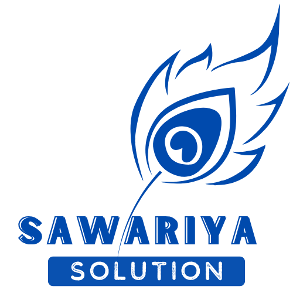

<div align="center">



# Sawariya Solution — Website & Admin CMS

A marketing website **and** a database-backed content management system (CMS)
for a Vadodara-based IT studio. A plain HTML/CSS/JS frontend powered by a
**Laravel + SQLite** backend with a REST API and an admin panel.


</div>

---

## 1. Project Overview

**Sawariya Solution** is a small IT studio in Vadodara that builds web, software,
mobile, and cloud products for businesses across India. This project is their
**official website** together with a built-in **admin panel (CMS)** to manage all
the site content.

- The **frontend** is framework-free — one stylesheet and two small scripts —
  giving a fast, responsive, fully fluid marketing site.
- Behind it sits a small **Laravel REST API** that stores all content in a
  **SQLite database**, so the admin panel edits real data (not just a browser's
  local storage).
- If the API is ever unavailable, the site automatically falls back to its
  bundled default content and still renders correctly.

---

## 2. Technology Used

| Layer | Technology |
|-------|-----------|
| Backend framework | **Laravel 13** (PHP **8.3+**) |
| API authentication | **Laravel Sanctum** (Bearer token) |
| Database | **SQLite** (file-based) — MySQL optional |
| Frontend | **HTML5, CSS3, Vanilla JavaScript** (no framework) |
| Fonts | Plus Jakarta Sans, Space Mono (Google Fonts) |
| Package manager | **Composer** |
| Local server | `php artisan serve` (or `start.bat`) |

---

## 3. Installation Steps

You need **PHP 8.3+** and **Composer**. On Windows, **Laragon** or **XAMPP**
bundles both. (No separate database server is required — the project uses SQLite.)

```bash
# 1. Install PHP dependencies
composer install

# 2. Create your environment file
cp .env.example .env          # On Windows: copy .env.example .env

# 3. Generate the application key
php artisan key:generate

# 4. Create the database, tables, content, and admin user
php artisan migrate --seed
```

That's it — the project is ready to run.

---

## 4. How to Run the Project

**Easiest way (Windows):**

> **Double-click `start.bat`** in the project folder. A window opens and runs the
> server — **keep that window open** while you use the site. Close it to stop.

**Or from the terminal:**

```bash
php artisan serve
```

Then open in your browser:

| Page | URL |
|------|-----|
| Public website | **http://localhost:8000/** |
| Admin panel (CMS) | **http://localhost:8000/admin/** |

> **Frontend-only preview (optional):** you can serve the `public/` folder
> statically (e.g. VS Code *Live Server* on port 3000). The pages render from
> their bundled defaults, but the **admin still needs the backend running** on
> port 8000 to log in and save.

---

## 5. Database Setup

This project uses **SQLite by default** — a single file, no database server to
install or start.

```bash
php artisan migrate --seed
```

This command:
- creates the database file `database/database.sqlite`,
- builds all tables (users, entries, singletons, tokens, etc.),
- loads all site content from `database/seeders/data/content.json`,
- creates the **admin user** (`admin` / `admin`).

**To reset / reload the database:**

```bash
php artisan migrate:fresh --seed
```

**To use MySQL instead of SQLite (optional):** in `.env` set
`DB_CONNECTION=mysql` with your host/port/database/username/password, create a
database named `sawariya`, then run `php artisan migrate --seed`.

---

## 6. Configuration / Important Files

| File / Folder | Purpose |
|---------------|---------|
| `.env` | Environment config (database, app key, sessions). **Created from `.env.example`.** |
| `start.bat` | One-click launcher for the backend server (Windows). |
| `routes/web.php` | Serves the public site and the `/admin` panel. |
| `routes/api.php` | The REST API (login, content, collections, singletons, uploads). |
| `app/Http/Controllers/Api/` | API controllers (Auth, Content, Collection, Singleton, Upload). |
| `app/Models/` | Eloquent models — `Entry`, `Singleton`, `User`. |
| `database/seeders/` | `ContentSeeder` + `data/content.json` (initial site content). |
| `database/database.sqlite` | The SQLite database file (created by migrate). |
| `public/` | **The frontend** — all `*.html` pages, CSS, JS, images. |
| `public/css/style.css` | The entire design system (colours, type, layout). |
| `public/js/data.js` | Bundled content defaults (offline fallback). |
| `public/js/ui.js` | UI engine — header, footer, banner, cards, API loader. |
| `public/admin/admin.js` | The schema-driven admin/CMS engine. |

---

## 7. Features / Modules

**Public website**
- **Home** — rotating hero banner, key stats, client logos, services,
  **Industries We Serve**, why-us, process, products, portfolio, testimonials,
  blog and a call-to-action.
- **About, Services, Products, Portfolio, Blog, Careers, Contact** pages.
- Fully **responsive** and **fluid** — the whole layout scales with the screen
  size and browser zoom; respects reduced-motion and keyboard focus.

**Admin Panel (CMS)** — `/admin/`
- Schema-driven editor for **every** part of the site: banner slides, services,
  products, portfolio, testimonials, blog posts, job openings, clients,
  partners, milestones, social links, settings/SEO, contact info and footer.
- **Image uploads** with live preview (saved to `public/images/uploads/`).
- Changes are saved to the database and appear on the public site on its next load.

**Backend / API**
- REST API with **Sanctum token authentication** (public reads need no auth).
- Flexible content storage: list items in an `entries` table, single records in
  a `singletons` table.
- Graceful **offline fallback** to bundled defaults if the API is unreachable.

---

## 8. Things to Update After Setup

- ✅ Run **`php artisan key:generate`** if you haven't (sets `APP_KEY`).
- 🔑 **Change the admin password** — it ships as `admin` / `admin` for demo use only.
- 📝 Update the real business content through the **admin panel** (or in `public/js/data.js`).
- ☎️ Update **contact details, social links and SEO** in the admin **Settings/Contact** sections.
- 🚀 For production: set `APP_ENV=production`, `APP_DEBUG=false`, and configure a
  real database/mail service if required.

---

## 9. Admin Login Details

| Field | Value |
|-------|-------|
| Admin URL | **http://localhost:8000/admin/** |
| Username | **admin** |
| Password | **admin** |

> The backend server must be running (use **`start.bat`** or `php artisan serve`).
> Tip: add `?demo=1` to the admin URL to auto-fill the demo login.

---

## 👤 Developer / Submission Details

| Field | Detail |
|-------|--------|
| **Full Name** | Animesh Sharma |
| **Contact Number** | 8791196138 |
| **College Name** | University of Petroleum and Energy Studies (UPES) |
| **Student ID** | 590014814 |
| **Email** | animeshsharmaup26@gmail.com |

---

<div align="center">

Made with 🦚 in Vadodara · © Sawariya Solution

</div>
